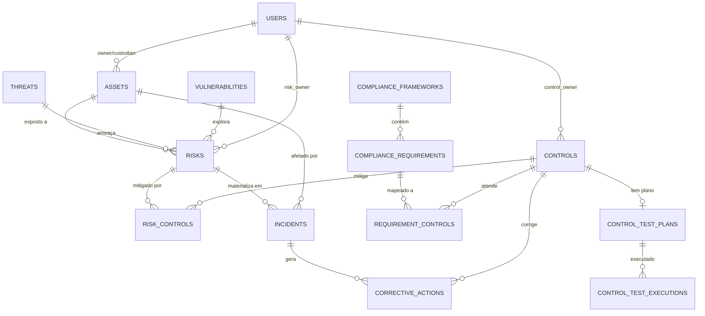

# 📋 Especificação Técnica: N360 GRC - ISMS Framework Evolution

**Versão**: 2.0  
**Data**: 06/11/2025  
**Projeto**: n360 Platform - GRC Module  
**Inspiração**: eramba.org ISMS Framework  
**Tipo**: Blueprint Arquitetônico

---

## 🎯 1. Contexto e Objetivo

### 1.1 Contexto do Ecossistema N360

O **N360** é um ecossistema operacional e de segurança composto por:

| Componente | Função | Tecnologia |
|------------|--------|------------|
| **SOC/XDR** | Detecção de ameaças, vulnerability management, FIM | Wazuh 4.9.0 |
| **NOC** | Monitoramento de infraestrutura, performance, availability | Zabbix 6.4 |
| **SOAR** | Orquestração, automação e middleware | Shuffle |
| **GRC** | Governança, Risco e Conformidade (atual: básico) | n360 Platform |

### 1.2 Objetivo da Evolução

Transformar o **N360 GRC** de um módulo básico de gestão de riscos em um **ISMS Framework completo**, inspirado na metodologia rigorosa do **eramba.org**, onde:

- **Alertas técnicos** (Wazuh/Zabbix) ganham **contexto de risco e conformidade**
- **Controles** são **auditados automaticamente** via Shuffle
- **Risco Residual** é calculado com base na **eficácia real dos controles**
- **Conformidade** é uma **derivada em tempo real** do status dos controles

### 1.3 Filosofia ISMS (Eramba-Inspired)

O N360 GRC operará no **ciclo PDCA** (Plan-Do-Check-Act):

```
┌─────────────────────────────────────────────┐
│  PLAN (GRC)                                 │
│  - Definir Ativos, Riscos, Controles       │
│  - Mapear Conformidade                      │
└──────────────┬──────────────────────────────┘
               │
               ↓
┌─────────────────────────────────────────────┐
│  DO (Wazuh/Zabbix/Shuffle)                  │
│  - Executar controles operacionais          │
│  - Monitorar ativos                         │
└──────────────┬──────────────────────────────┘
               │
               ↓
┌─────────────────────────────────────────────┐
│  CHECK (Shuffle → GRC)                      │
│  - Testar eficácia de controles             │
│  - Detectar materialização de risco         │
└──────────────┬──────────────────────────────┘
               │
               ↓
┌─────────────────────────────────────────────┐
│  ACT (GRC → Shuffle)                        │
│  - Planos de ação (CAPA)                    │
│  - Remediação automatizada                  │
└─────────────────────────────────────────────┘
```

---

## 🏗️ 2. Arquitetura de Módulos (Eramba-Inspired)

### 2.1 Módulo 1: Gestão de Contexto e Ativos (CMDB)

**Objetivo**: Fonte Única de Verdade (SSOT) para todos os ativos organizacionais.

#### Entidades Principais

##### 1.1 Asset (Ativo)
```sql
CREATE TABLE assets (
  id UUID PRIMARY KEY,
  org_id UUID NOT NULL,
  
  -- Identificação
  asset_code VARCHAR(50) UNIQUE NOT NULL,
  name VARCHAR(255) NOT NULL,
  description TEXT,
  
  -- Classificação
  asset_type VARCHAR(50) NOT NULL, 
    -- hardware, software, information, people, service
  category VARCHAR(100),
  
  -- Valor (CIA Triad)
  confidentiality_impact INTEGER CHECK (confidentiality_impact BETWEEN 1 AND 5),
  integrity_impact INTEGER CHECK (integrity_impact BETWEEN 1 AND 5),
  availability_impact INTEGER CHECK (availability_impact BETWEEN 1 AND 5),
  business_impact INTEGER GENERATED ALWAYS AS 
    (confidentiality_impact + integrity_impact + availability_impact) STORED,
  
  -- Propriedade
  asset_owner_id UUID REFERENCES users(id), -- Proprietário do Ativo
  risk_owner_id UUID REFERENCES users(id),  -- Proprietário do Risco
  custodian_id UUID REFERENCES users(id),   -- Custodiante
  
  -- Localização
  physical_location VARCHAR(255),
  network_location VARCHAR(255), -- IP, FQDN
  
  -- Integração
  wazuh_agent_id VARCHAR(100),  -- ID do agente Wazuh
  zabbix_host_id VARCHAR(100),  -- ID do host Zabbix
  
  -- Lifecycle
  acquisition_date DATE,
  disposal_date DATE,
  status VARCHAR(20) DEFAULT 'active', -- active, retired, disposed
  
  -- Metadata
  tags TEXT[],
  created_at TIMESTAMPTZ DEFAULT NOW(),
  updated_at TIMESTAMPTZ DEFAULT NOW()
);
```

**Funcionalidades**:
- Hierarquia de ativos (parent-child)
- Classificação CID automática baseada em tipo
- Relacionamento com Wazuh/Zabbix via IDs

---

### 2.2 Módulo 2: Bibliotecas de Ameaças e Vulnerabilidades (TVL)

**Objetivo**: Catálogos reutilizáveis de ameaças e vulnerabilidades.

##### 2.1 Threat (Ameaça)
```sql
CREATE TABLE threats (
  id UUID PRIMARY KEY,
  org_id UUID NOT NULL,
  
  -- Identificação
  threat_code VARCHAR(50) UNIQUE NOT NULL,
  name VARCHAR(255) NOT NULL,
  description TEXT,
  
  -- Classificação
  threat_category VARCHAR(50), 
    -- cyber, physical, environmental, human, legal
  threat_source VARCHAR(50), 
    -- external_attacker, insider, natural_disaster, supplier
  
  -- Probabilidade Base
  likelihood_score INTEGER CHECK (likelihood_score BETWEEN 1 AND 5),
  -- 1=Raro(<10%), 2=Improvável(10-25%), 3=Possível(25-50%), 
  -- 4=Provável(50-75%), 5=Quase Certo(>75%)
  
  -- Metadata
  references TEXT[], -- URLs de fontes (MITRE ATT&CK, etc)
  tags TEXT[],
  created_at TIMESTAMPTZ DEFAULT NOW()
);
```

##### 2.2 Vulnerability (Vulnerabilidade)
```sql
CREATE TABLE vulnerabilities (
  id UUID PRIMARY KEY,
  org_id UUID NOT NULL,
  
  -- Identificação
  vuln_code VARCHAR(50) UNIQUE NOT NULL,
  name VARCHAR(255) NOT NULL,
  description TEXT,
  
  -- Classificação
  vuln_category VARCHAR(50),
    -- technical, organizational, physical
  vuln_type VARCHAR(50),
    -- software_bug, misconfiguration, lack_of_control, human_error
  
  -- Severidade Base
  severity_score INTEGER CHECK (severity_score BETWEEN 1 AND 5),
  -- 1=Baixa, 2=Média, 3=Alta, 4=Crítica, 5=Extrema
  
  -- CVE/CWE
  cve_id VARCHAR(50),
  cvss_score DECIMAL(3,1),
  
  -- Integração Wazuh
  wazuh_vuln_id VARCHAR(100), -- ID da vulnerabilidade no Wazuh
  
  -- Metadata
  references TEXT[],
  tags TEXT[],
  created_at TIMESTAMPTZ DEFAULT NOW()
);
```

**Funcionalidades**:
- Importação automática de CVEs via Wazuh Vulnerability Detector
- Biblioteca corporativa de ameaças (reutilizável)
- Mapeamento MITRE ATT&CK

---

### 2.3 Módulo 3: Motor de Risco (Risk Engine)

**Objetivo**: Cálculo dinâmico de Risco Inherente e Residual.

##### 3.1 Risk (Risco)
```sql
CREATE TABLE risks (
  id UUID PRIMARY KEY,
  org_id UUID NOT NULL,
  
  -- Identificação
  risk_code VARCHAR(50) UNIQUE NOT NULL,
  title VARCHAR(255) NOT NULL,
  description TEXT,
  
  -- Composição (Asset + Threat + Vulnerability)
  asset_id UUID NOT NULL REFERENCES assets(id),
  threat_id UUID NOT NULL REFERENCES threats(id),
  vulnerability_id UUID NOT NULL REFERENCES vulnerabilities(id),
  
  -- Risco Inherente (antes de controles)
  inherent_likelihood INTEGER CHECK (inherent_likelihood BETWEEN 1 AND 5),
  inherent_impact INTEGER CHECK (inherent_impact BETWEEN 1 AND 5),
  inherent_risk_score INTEGER GENERATED ALWAYS AS 
    (inherent_likelihood * inherent_impact) STORED,
  
  -- Risco Residual (após controles)
  residual_likelihood INTEGER CHECK (residual_likelihood BETWEEN 1 AND 5),
  residual_impact INTEGER CHECK (residual_impact BETWEEN 1 AND 5),
  residual_risk_score INTEGER GENERATED ALWAYS AS 
    (residual_likelihood * residual_impact) STORED,
  
  -- Tratamento
  treatment VARCHAR(30) NOT NULL, -- mitigate, accept, transfer, avoid
  treatment_plan TEXT,
  treatment_status VARCHAR(20) DEFAULT 'planned',
    -- planned, in_progress, implemented, verified
  
  -- Propriedade
  risk_owner_id UUID REFERENCES users(id), -- Aceita o risco
  
  -- Materialização
  materialization_count INTEGER DEFAULT 0, -- Quantas vezes se materializou
  last_materialization_date TIMESTAMPTZ,
  
  -- Datas
  identified_date TIMESTAMPTZ DEFAULT NOW(),
  target_treatment_date TIMESTAMPTZ,
  next_review_date TIMESTAMPTZ,
  
  -- Status
  status VARCHAR(20) DEFAULT 'open',
    -- open, treating, treated, accepted, closed
  
  -- Metadata
  tags TEXT[],
  created_at TIMESTAMPTZ DEFAULT NOW(),
  updated_at TIMESTAMPTZ DEFAULT NOW()
);
```

##### 3.2 Risk-Control Mapping (Controles que mitigam o Risco)
```sql
CREATE TABLE risk_controls (
  id UUID PRIMARY KEY,
  risk_id UUID NOT NULL REFERENCES risks(id) ON DELETE CASCADE,
  control_id UUID NOT NULL REFERENCES controls(id) ON DELETE CASCADE,
  
  -- Eficácia da mitigação
  mitigation_effectiveness DECIMAL(3,2), -- 0.00 a 1.00
  -- Ex: 0.80 = Controle reduz risco em 80%
  
  -- Metadata
  created_at TIMESTAMPTZ DEFAULT NOW(),
  
  UNIQUE(risk_id, control_id)
);
```

**Fórmula de Risco**:
```
Risco Inherente = Likelihood (Threat × Vulnerability) × Impact (Asset CIA)

Risco Residual = Risco Inherente × (1 - Σ Control Effectiveness)
```

**Funcionalidades**:
- Cálculo automático de Risk Score
- Atualização de Residual Risk baseada em eficácia de controles
- Threshold alerts (quando Residual > Accepted)
- Heat Map 5×5 (Likelihood × Impact)

---

### 2.4 Módulo 4: Gestão e Auditoria de Controles

**Objetivo**: Controles testados automaticamente via Shuffle.

##### 4.1 Control (Controle)
```sql
CREATE TABLE controls (
  id UUID PRIMARY KEY,
  org_id UUID NOT NULL,
  
  -- Identificação
  control_id VARCHAR(50) UNIQUE NOT NULL, -- ISO-27001-A.12.2.1
  title VARCHAR(255) NOT NULL,
  description TEXT,
  
  -- Classificação
  framework VARCHAR(50) NOT NULL, -- ISO 27001, NIST CSF, CIS, PCI-DSS, LGPD
  control_type VARCHAR(30) NOT NULL, 
    -- preventive, detective, corrective, compensating
  category VARCHAR(50),
    -- access_control, crypto, physical, incident_response, etc
  
  -- Proprietário
  control_owner_id UUID REFERENCES users(id),
  responsible_team VARCHAR(100),
  
  -- Status de Implementação
  implementation_status VARCHAR(30) DEFAULT 'not_implemented',
    -- not_implemented, planned, partial, implemented, verified
  implementation_date TIMESTAMPTZ,
  implementation_notes TEXT,
  
  -- Eficácia (calculada pelos testes)
  effectiveness_score DECIMAL(3,2), -- 0.00 a 1.00 (média dos últimos testes)
  effectiveness_status VARCHAR(20), -- effective, partially_effective, ineffective
  
  -- Metadata
  tags TEXT[],
  created_at TIMESTAMPTZ DEFAULT NOW(),
  updated_at TIMESTAMPTZ DEFAULT NOW()
);
```

##### 4.2 Control Test Plan (Plano de Teste)
```sql
CREATE TABLE control_test_plans (
  id UUID PRIMARY KEY,
  control_id UUID NOT NULL REFERENCES controls(id) ON DELETE CASCADE,
  
  -- Definição do Teste
  test_objective TEXT NOT NULL,
  test_procedure TEXT NOT NULL, -- Como será testado
  expected_result TEXT NOT NULL, -- Critério Pass/Fail
  
  -- Frequência
  test_frequency INTEGER NOT NULL, -- Dias (30, 90, 180, 365)
  next_test_date TIMESTAMPTZ,
  
  -- Método de Coleta de Evidência
  evidence_collection_method VARCHAR(50),
    -- automated_wazuh, automated_zabbix, automated_shuffle, manual
  
  -- Configuração Shuffle (para testes automatizados)
  shuffle_workflow_id VARCHAR(100), -- ID do workflow no Shuffle
  shuffle_workflow_name VARCHAR(255),
  
  -- Metadata
  created_at TIMESTAMPTZ DEFAULT NOW(),
  updated_at TIMESTAMPTZ DEFAULT NOW(),
  
  UNIQUE(control_id) -- 1 plano por controle
);
```

##### 4.3 Control Test Execution (Execução de Teste)
```sql
CREATE TABLE control_test_executions (
  id UUID PRIMARY KEY,
  control_id UUID NOT NULL REFERENCES controls(id),
  test_plan_id UUID NOT NULL REFERENCES control_test_plans(id),
  
  -- Execução
  test_date TIMESTAMPTZ DEFAULT NOW(),
  tested_by_user_id UUID REFERENCES users(id), -- NULL se automatizado
  test_method VARCHAR(50), -- automated, manual
  
  -- Resultado
  test_result VARCHAR(20) NOT NULL, -- passed, failed, partial
  effectiveness_score DECIMAL(3,2), -- 0.00 a 1.00
  
  -- Evidência
  evidence_type VARCHAR(50), -- wazuh_report, zabbix_report, screenshot, document
  evidence_url TEXT, -- URL do arquivo no Supabase Storage
  evidence_description TEXT,
  evidence_json JSONB, -- Dados brutos da evidência (JSON do Wazuh/Zabbix)
  
  -- Origem (integração)
  source VARCHAR(50), -- shuffle, wazuh, zabbix, manual
  shuffle_execution_id VARCHAR(100), -- ID da execução no Shuffle
  
  -- Notas
  findings TEXT, -- Descobertas do teste
  recommendations TEXT,
  
  -- Metadata
  created_at TIMESTAMPTZ DEFAULT NOW()
);
```

**Fluxo de Teste Automatizado**:
```
1. GRC: Agenda teste (cron)
2. GRC → Shuffle: POST /api/shuffle/execute-workflow
   Body: {
     "workflow_id": "test_antivirus_status",
     "control_id": "ISO-27001-A.12.2.1",
     "asset_ids": ["all_servers"]
   }
3. Shuffle → Wazuh: Query agent status
4. Wazuh → Shuffle: JSON response
5. Shuffle → GRC: POST /api/controls/{id}/test-results
   Body: {
     "test_result": "passed",
     "effectiveness_score": 0.98,
     "evidence_json": {...}
   }
6. GRC: Atualiza Control.effectiveness_score
7. GRC: Atualiza Risk.residual_risk_score (recalcula)
```

**Funcionalidades**:
- Agenda automática de testes (cron)
- Webhook para Shuffle executar testes
- Histórico completo de execuções
- Audit trail inviolável

---

### 2.5 Módulo 5: Gestão de Conformidade (Compliance)

**Objetivo**: Mapeamento de frameworks regulatórios aos controles.

##### 5.1 Compliance Framework
```sql
CREATE TABLE compliance_frameworks (
  id UUID PRIMARY KEY,
  org_id UUID NOT NULL,
  
  -- Identificação
  framework_code VARCHAR(50) UNIQUE NOT NULL, -- ISO27001, LGPD, NIST_CSF
  name VARCHAR(255) NOT NULL,
  description TEXT,
  
  -- Classificação
  framework_type VARCHAR(50), -- standard, regulation, guideline
  jurisdiction VARCHAR(100), -- International, Brazil, EU, USA
  
  -- Status na Org
  adoption_status VARCHAR(30), -- adopted, in_progress, planned, not_applicable
  adoption_date TIMESTAMPTZ,
  certification_date TIMESTAMPTZ,
  next_audit_date TIMESTAMPTZ,
  
  -- Metadata
  official_url TEXT,
  version VARCHAR(50),
  created_at TIMESTAMPTZ DEFAULT NOW()
);
```

##### 5.2 Compliance Requirement (Requisito)
```sql
CREATE TABLE compliance_requirements (
  id UUID PRIMARY KEY,
  framework_id UUID NOT NULL REFERENCES compliance_frameworks(id),
  
  -- Identificação
  requirement_code VARCHAR(100) NOT NULL, -- A.5.1, AC-1, 3.1.1
  title VARCHAR(255) NOT NULL,
  description TEXT,
  
  -- Hierarquia
  parent_requirement_id UUID REFERENCES compliance_requirements(id),
  requirement_level INTEGER, -- 1=Domain, 2=Control, 3=Sub-control
  
  -- Aplicabilidade
  is_applicable BOOLEAN DEFAULT true,
  justification_not_applicable TEXT,
  
  -- Metadata
  created_at TIMESTAMPTZ DEFAULT NOW()
);
```

##### 5.3 Requirement-Control Mapping
```sql
CREATE TABLE requirement_controls (
  id UUID PRIMARY KEY,
  requirement_id UUID NOT NULL REFERENCES compliance_requirements(id),
  control_id UUID NOT NULL REFERENCES controls(id),
  
  -- Cobertura
  coverage_level VARCHAR(20), -- full, partial, none
  coverage_notes TEXT,
  
  -- Metadata
  created_at TIMESTAMPTZ DEFAULT NOW(),
  
  UNIQUE(requirement_id, control_id)
);
```

##### 5.4 Statement of Applicability (SoA) - VIEW
```sql
CREATE OR REPLACE VIEW soa_iso27001 AS
SELECT 
  r.requirement_code,
  r.title as requirement_title,
  r.is_applicable,
  r.justification_not_applicable,
  c.control_id,
  c.title as control_title,
  c.implementation_status,
  c.effectiveness_score,
  c.effectiveness_status,
  rc.coverage_level,
  -- Último teste
  (SELECT test_result 
   FROM control_test_executions 
   WHERE control_id = c.id 
   ORDER BY test_date DESC 
   LIMIT 1) as last_test_result,
  (SELECT test_date 
   FROM control_test_executions 
   WHERE control_id = c.id 
   ORDER BY test_date DESC 
   LIMIT 1) as last_test_date
FROM compliance_requirements r
LEFT JOIN requirement_controls rc ON r.id = rc.requirement_id
LEFT JOIN controls c ON rc.control_id = c.id
WHERE r.framework_id = (SELECT id FROM compliance_frameworks WHERE framework_code = 'ISO27001')
ORDER BY r.requirement_code;
```

**Funcionalidades**:
- SoA dinâmico (atualizado em tempo real)
- Gap Analysis automático
- Compliance Score por framework:
  ```
  Score = (Controles Efetivos / Total Controles Aplicáveis) × 100
  ```

---

### 2.6 Módulo 6: Gestão de Incidentes e Ações

**Objetivo**: Materialização de risco e ciclo de remediação.

##### 6.1 Incident (Incidente de GRC)
```sql
CREATE TABLE incidents (
  id UUID PRIMARY KEY,
  org_id UUID NOT NULL,
  
  -- Identificação
  incident_code VARCHAR(50) UNIQUE NOT NULL,
  title VARCHAR(255) NOT NULL,
  description TEXT,
  
  -- Materialização de Risco
  risk_id UUID REFERENCES risks(id), -- Risco que se materializou
  materialization_date TIMESTAMPTZ DEFAULT NOW(),
  
  -- Ativo Afetado
  asset_id UUID REFERENCES assets(id),
  
  -- Controle que Falhou
  failed_control_id UUID REFERENCES controls(id),
  control_failure_reason TEXT,
  
  -- Classificação
  incident_category VARCHAR(50), 
    -- security_breach, data_loss, system_outage, compliance_violation
  severity VARCHAR(20), -- critical, high, medium, low
  
  -- Impacto
  impact_description TEXT,
  financial_impact DECIMAL(15,2),
  reputational_impact VARCHAR(50), -- high, medium, low
  
  -- Status
  status VARCHAR(20) DEFAULT 'open',
    -- open, investigating, contained, resolved, closed
  
  -- Origem (Integração)
  source VARCHAR(50), -- wazuh, zabbix, shuffle, manual
  source_alert_id VARCHAR(100), -- ID do alerta original
  source_alert_json JSONB, -- JSON do alerta completo
  
  -- Responsabilidade
  incident_manager_id UUID REFERENCES users(id),
  risk_owner_notified_at TIMESTAMPTZ,
  
  -- Timeline
  detected_at TIMESTAMPTZ,
  reported_at TIMESTAMPTZ DEFAULT NOW(),
  contained_at TIMESTAMPTZ,
  resolved_at TIMESTAMPTZ,
  closed_at TIMESTAMPTZ,
  
  -- Root Cause Analysis
  root_cause TEXT,
  lessons_learned TEXT,
  
  -- Metadata
  tags TEXT[],
  created_at TIMESTAMPTZ DEFAULT NOW(),
  updated_at TIMESTAMPTZ DEFAULT NOW()
);
```

##### 6.2 Corrective Action (CAPA - Corrective and Preventive Action)
```sql
CREATE TABLE corrective_actions (
  id UUID PRIMARY KEY,
  org_id UUID NOT NULL,
  
  -- Origem
  incident_id UUID REFERENCES incidents(id),
  control_id UUID REFERENCES controls(id), -- Controle a ser corrigido/criado
  risk_id UUID REFERENCES risks(id),
  
  -- Ação
  action_type VARCHAR(30), -- corrective, preventive
  action_title VARCHAR(255) NOT NULL,
  action_description TEXT NOT NULL,
  
  -- Implementação
  action_plan TEXT,
  assigned_to_id UUID REFERENCES users(id),
  priority VARCHAR(20), -- critical, high, medium, low
  
  -- Automação (Shuffle)
  is_automated BOOLEAN DEFAULT false,
  shuffle_workflow_id VARCHAR(100), -- Workflow de remediação
  shuffle_execution_id VARCHAR(100), -- ID da execução
  automation_status VARCHAR(20), -- pending, in_progress, completed, failed
  
  -- Timeline
  due_date TIMESTAMPTZ,
  started_at TIMESTAMPTZ,
  completed_at TIMESTAMPTZ,
  verified_at TIMESTAMPTZ,
  
  -- Status
  status VARCHAR(20) DEFAULT 'open',
    -- open, in_progress, completed, verified, cancelled
  
  -- Evidência de Conclusão
  completion_evidence_url TEXT,
  completion_notes TEXT,
  
  -- Metadata
  created_at TIMESTAMPTZ DEFAULT NOW(),
  updated_at TIMESTAMPTZ DEFAULT NOW()
);
```

**Fluxo de Materialização de Risco**:
```
1. Wazuh: Detecta evento crítico (ex: Rootkit)
2. Wazuh → Shuffle: Webhook
3. Shuffle: Consulta GRC por Asset ID
   GET /api/assets/by-wazuh-id/{agent_id}
   → Retorna: {asset_id, criticality, risks[], controls[]}
4. Shuffle: Cria Incidente no GRC
   POST /api/incidents
   Body: {
     "asset_id": "...",
     "risk_id": "...", (risco de comprometimento)
     "failed_control_id": "...", (controle de integridade)
     "source": "wazuh",
     "source_alert_json": {...}
   }
5. GRC: Automaticamente:
   - Incrementa risk.materialization_count
   - Atualiza control.effectiveness_status = "ineffective"
   - Notifica risk_owner
   - Recalcula residual_risk_score
6. GRC: Cria CAPA automaticamente
7. CAPA pode disparar Shuffle para remediação
```

---

## 🔗 3. Arquitetura de Integração (API RESTful Bidirecional)

### 3.1 API Endpoints (GRC ↔ Shuffle)

#### A. Contexto (Shuffle consulta GRC)

**GET `/api/v1/assets/{id}`**
- Retorna: Asset + Risks + Controls + Owner

**GET `/api/v1/assets/by-wazuh-id/{wazuh_agent_id}`**
- Busca ativo por Wazuh Agent ID

**GET `/api/v1/assets/{id}/context`**
- Retorna contexto completo:
  ```json
  {
    "asset": {...},
    "risks": [...],
    "controls": [...],
    "compliance_status": {...},
    "active_incidents": [...]
  }
  ```

**GET `/api/v1/risks/{id}/current-score`**
- Retorna: Inherent + Residual + Controls

#### B. Teste de Controles (GRC → Shuffle → GRC)

**POST `/api/v1/controls/{id}/schedule-test`**
- GRC agenda teste
- Response: `test_execution_id`

**POST `/api/v1/controls/{id}/test-results`**
- Shuffle envia resultado
- Body:
  ```json
  {
    "test_result": "passed",
    "effectiveness_score": 0.95,
    "evidence_json": {...},
    "evidence_url": "https://...",
    "shuffle_execution_id": "abc123"
  }
  ```

#### C. Incidentes (Shuffle cria no GRC)

**POST `/api/v1/incidents`**
- Body:
  ```json
  {
    "asset_id": "uuid",
    "risk_id": "uuid",
    "failed_control_id": "uuid",
    "title": "Rootkit detected on server-01",
    "severity": "critical",
    "source": "wazuh",
    "source_alert_json": {...}
  }
  ```

#### D. Ações (GRC → Shuffle)

**POST `/api/v1/corrective-actions/{id}/automate`**
- GRC dispara automação no Shuffle
- Response: `shuffle_execution_id`

**PATCH `/api/v1/corrective-actions/{id}/status`**
- Shuffle atualiza status da ação

### 3.2 Webhooks (GRC notifica Shuffle)

**Webhook: Control Test Scheduled**
- Evento: GRC agenda teste
- Payload:
  ```json
  {
    "event": "control_test_scheduled",
    "control_id": "uuid",
    "test_plan_id": "uuid",
    "shuffle_workflow_id": "workflow_123",
    "test_execution_id": "uuid"
  }
  ```

**Webhook: Risk Threshold Exceeded**
- Evento: Risco residual > limite aceitável
- Payload:
  ```json
  {
    "event": "risk_threshold_exceeded",
    "risk_id": "uuid",
    "residual_score": 20,
    "threshold": 12
  }
  ```

---

## 🛠️ 4. Stack Tecnológico Recomendado

### 4.1 Backend

**Linguagem**: **Node.js 20+** (já em uso no n360)
- Razão: Consistência com stack atual, performance, ecossistema maduro

**Framework**: **Express.js** (atual) ou **NestJS** (recomendado para escala)
- NestJS: TypeScript nativo, modular, suporte a microservices

**ORM**: **Prisma** ou **TypeORM**
- Prisma: Type-safe, migrations automáticas, performance
- TypeORM: Mais maduro, suporte a relacionamentos complexos

**Validação**: **Zod** (já em uso)

**Autenticação**: **Supabase Auth** (já em uso)

### 4.2 Frontend

**Framework**: **React 18 + Vite** (já em uso)

**UI Components**: **shadcn/ui + Tailwind CSS** (já em uso)

**Novos componentes necessários**:
- **Diagrams**: react-flow (ERD, fluxos)
- **Charts**: recharts (dashboards GRC)
- **Tables**: @tanstack/react-table (listagens complexas)
- **Forms**: react-hook-form + zod

### 4.3 Banco de Dados

**Principal**: **PostgreSQL 15+** via **Supabase** (já em uso)

**Features necessárias**:
- ✅ JSONB (para evidence_json)
- ✅ Generated Columns (risk_score)
- ✅ Row Level Security (multi-tenancy)
- ✅ Triggers (audit trail)
- ✅ Views (SoA, Compliance Score)

### 4.4 Storage

**Evidências**: **Supabase Storage** (já em uso)
- Armazenar: Screenshots, relatórios PDF, JSONs de evidência

### 4.5 Integrações

**Shuffle**: **REST API + Webhooks**
**Wazuh**: **REST API** (já integrado)
**Zabbix**: **REST API** (já integrado)

---

## 📊 5. Diagrama de Entidade-Relacionamento (ERD)



---

## 🔄 6. Diagramas de Fluxo de Integração

### 6.1 Fluxo: Validação Automatizada de Controles

```
┌─────────┐         ┌─────────┐         ┌─────────┐         ┌─────────┐
│   GRC   │         │ Shuffle │         │  Wazuh  │         │  Zabbix │
└────┬────┘         └────┬────┘         └────┬────┘         └────┬────┘
     │                   │                   │                   │
     │ 1. Agenda Teste   │                   │                   │
     │   (Cron job)      │                   │                   │
     ├──────────────────>│                   │                   │
     │ POST /shuffle/    │                   │                   │
     │ execute-workflow  │                   │                   │
     │                   │                   │                   │
     │                   │ 2. Executa Query  │                   │
     │                   ├──────────────────>│                   │
     │                   │ GET /agents/      │                   │
     │                   │ summary/status    │                   │
     │                   │                   │                   │
     │                   │ 3. JSON Response  │                   │
     │                   │<──────────────────┤                   │
     │                   │ {agents: [...]}   │                   │
     │                   │                   │                   │
     │ 4. Envia Resultado│                   │                   │
     │<──────────────────┤                   │                   │
     │ POST /controls/   │                   │                   │
     │ {id}/test-results │                   │                   │
     │                   │                   │                   │
     │ 5. Atualiza       │                   │                   │
     │    Control        │                   │                   │
     │    Effectiveness  │                   │                   │
     │                   │                   │                   │
     │ 6. Recalcula      │                   │                   │
     │    Risk Residual  │                   │                   │
     │                   │                   │                   │
```

### 6.2 Fluxo: Materialização de Risco (Incidente)

```
┌─────────┐         ┌─────────┐         ┌─────────┐
│  Wazuh  │         │ Shuffle │         │   GRC   │
└────┬────┘         └────┬────┘         └────┬────┘
     │                   │                   │
     │ 1. Alerta Crítico │                   │
     ├──────────────────>│                   │
     │ Webhook           │                   │
     │ {rule: 5710}      │                   │
     │                   │                   │
     │                   │ 2. Consulta Ativo │
     │                   ├──────────────────>│
     │                   │ GET /assets/      │
     │                   │ by-wazuh-id/123   │
     │                   │                   │
     │                   │ 3. Contexto       │
     │                   │<──────────────────┤
     │                   │ {asset, risks,    │
     │                   │  controls}        │
     │                   │                   │
     │                   │ 4. Cria Incidente │
     │                   ├──────────────────>│
     │                   │ POST /incidents   │
     │                   │                   │
     │                   │                   │ 5. GRC Auto:
     │                   │                   ├─> Incrementa
     │                   │                   │   materialization
     │                   │                   ├─> Atualiza
     │                   │                   │   control status
     │                   │                   ├─> Recalcula
     │                   │                   │   residual risk
     │                   │                   ├─> Notifica
     │                   │                   │   risk_owner
     │                   │                   ├─> Cria CAPA
```

### 6.3 Fluxo: Remediação Automatizada (CAPA)

```
┌─────────┐         ┌─────────┐         ┌─────────┐
│   GRC   │         │ Shuffle │         │  Wazuh  │
└────┬────┘         └────┬────┘         └────┬────┘
     │                   │                   │
     │ 1. CAPA Criado    │                   │
     │    (manual/auto)  │                   │
     │                   │                   │
     │ 2. Dispara Auto   │                   │
     ├──────────────────>│                   │
     │ POST /corrective- │                   │
     │ actions/{id}/     │                   │
     │ automate          │                   │
     │                   │                   │
     │                   │ 3. Executa Ação   │
     │                   ├──────────────────>│
     │                   │ PUT /agents/123/  │
     │                   │ upgrade           │
     │                   │                   │
     │                   │ 4. Confirmação    │
     │                   │<──────────────────┤
     │                   │                   │
     │ 5. Atualiza CAPA  │                   │
     │<──────────────────┤                   │
     │ PATCH /corrective-│                   │
     │ actions/{id}/     │                   │
     │ status            │                   │
     │                   │                   │
     │ 6. Agenda Re-test │                   │
     │    do Controle    │                   │
```

---

## 📈 7. Estimativa de Esforço

### 7.1 MVP (Minimum Viable Product)

**Escopo MVP**:
- Módulos 1-4 completos (CMDB, TVL, Risk, Controls)
- API RESTful (30+ endpoints)
- Integração Shuffle (webhook bidirecional)
- 1 fluxo automatizado (Control Testing)
- 1 fluxo de materialização (Incidents)

#### Backend (240-320 horas)

| Atividade | Horas | Dias |
|-----------|-------|------|
| Setup inicial (Prisma, migrations) | 16h | 2d |
| CMDB (Assets + APIs) | 32h | 4d |
| TVL (Threats, Vulnerabilities) | 24h | 3d |
| Risk Engine (cálculos, APIs) | 40h | 5d |
| Controls + Test Plans | 48h | 6d |
| Control Test Executions + automação | 40h | 5d |
| Incidents + CAPA | 32h | 4d |
| API REST completa (docs OpenAPI) | 24h | 3d |
| Integração Shuffle (webhooks) | 32h | 4d |
| Testes unitários/integração | 40h | 5d |
| **SUBTOTAL BACKEND** | **328h** | **41d** |

#### Frontend (160-200 horas)

| Atividade | Horas | Dias |
|-----------|-------|------|
| CMDB UI (CRUD Assets) | 32h | 4d |
| Risk Management UI | 40h | 5d |
| Risk Matrix (Heat Map interativo) | 24h | 3d |
| Controls Management UI | 40h | 5d |
| Control Test History/Results | 24h | 3d |
| Incidents Dashboard | 32h | 4d |
| Charts e Dashboards (GRC KPIs) | 32h | 4d |
| **SUBTOTAL FRONTEND** | **224h** | **28d** |

#### Database & DevOps (40-60 horas)

| Atividade | Horas | Dias |
|-----------|-------|------|
| Schema SQL completo | 24h | 3d |
| Migrations Prisma | 8h | 1d |
| RLS Policies | 16h | 2d |
| Views (SoA, Scores) | 16h | 2d |
| Seeds (dados exemplo) | 8h | 1d |
| **SUBTOTAL DEVOPS** | **72h** | **9d** |

#### Documentação (24-32 horas)

| Atividade | Horas | Dias |
|-----------|-------|------|
| API Docs (OpenAPI/Swagger) | 16h | 2d |
| User Guide (ISMS) | 16h | 2d |
| Admin Guide | 16h | 2d |
| Diagramas (ERD, Fluxos) | 8h | 1d |
| **SUBTOTAL DOCS** | **56h** | **7d** |

### **TOTAL MVP: 680 horas (85 dias úteis)**

Assumindo **1 desenvolvedor full-stack** trabalhando **8h/dia**:
- **Tempo calendário**: ~17 semanas (4 meses)

Assumindo **2 desenvolvedores** (1 backend + 1 frontend):
- **Tempo calendário**: ~9 semanas (2 meses)

### 7.2 Fase 2: Conformidade & Relatórios (+160h)

- Módulo 5 (Compliance Frameworks)
- SoA Dinâmico
- Gap Analysis
- Relatórios PDF

### 7.3 Fase 3: Dashboards Executivos (+80h)

- Dashboard CISO (GRC completo)
- Trends e KPIs históricos
- Exportação de relatórios

---

## 🎯 8. Critérios de Sucesso

### 8.1 Funcionalidades Mandatórias (MVP)

- [ ] CMDB com 100+ ativos cadastrados
- [ ] 20+ controles definidos com test plans
- [ ] 10+ riscos mapeados (Asset + Threat + Vulnerability)
- [ ] 1 teste de controle automatizado via Shuffle funcionando
- [ ] 1 incidente criado automaticamente a partir de alerta Wazuh
- [ ] Cálculo de Risco Residual atualizado após teste de controle
- [ ] API RESTful 100% documentada (OpenAPI)

### 8.2 Métricas de Qualidade

- **Cobertura de testes**: 70%+
- **Tempo de resposta API**: < 200ms (95th percentile)
- **Uptime**: 99.5%+
- **Documentação**: 100% dos endpoints

### 8.3 Integração

- **Shuffle**: Comunicação bidirecional funcionando
- **Wazuh**: Alertas criando incidentes automaticamente
- **Zabbix**: Problemas críticos criando incidentes

---

## 📚 9. Referências e Inspiração

### 9.1 Eramba Framework
- **URL**: https://www.eramba.org
- **Documentação**: https://github.com/eramba/eramba
- **Features-chave**:
  - CMDB integrado a risco
  - Controles testáveis
  - SoA automatizado
  - Audit trail completo

### 9.2 Standards ISMS
- **ISO/IEC 27001:2022**: Information Security Management
- **NIST Cybersecurity Framework**: Risk management
- **COBIT 2019**: Governance framework

### 9.3 Integrações
- **Wazuh API**: https://documentation.wazuh.com/current/user-manual/api/
- **Zabbix API**: https://www.zabbix.com/documentation/current/en/manual/api
- **Shuffle**: https://shuffler.io/docs/API

---

## 🚀 10. Próximos Passos

1. **Aprovação desta especificação**
2. **Setup do ambiente de desenvolvimento**
3. **Criação do schema SQL (Prisma)**
4. **Desenvolvimento do backend (APIs CMDB + Risk)**
5. **Prototipação do frontend (Risk Matrix + CMDB)**
6. **Integração Shuffle (primeiro fluxo)**
7. **Testes e validação**
8. **Deploy em staging**
9. **Documentação final**
10. **Deploy em produção**

---

**Especificação criada por**: ness. (n360 Team)  
**Data**: 06/11/2025  
**Versão**: 2.0  
**Status**: Aguardando Aprovação para Implementação

